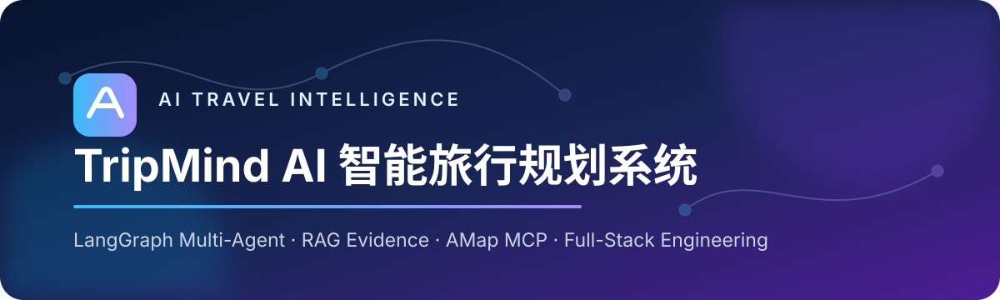
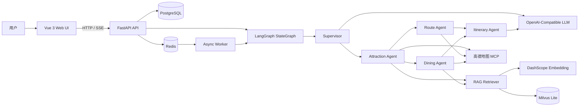
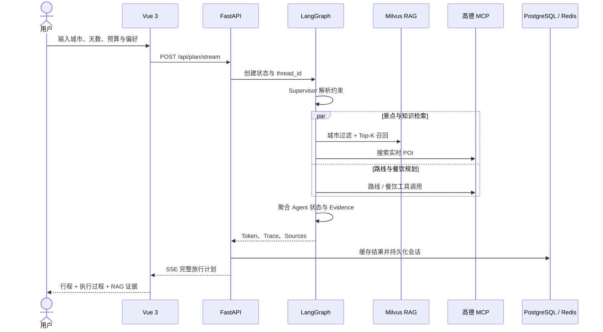
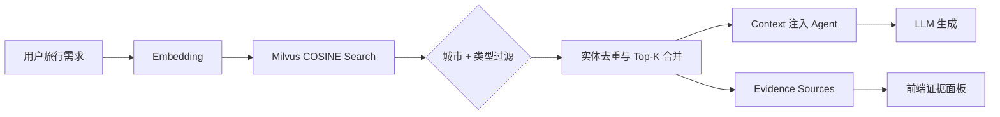

<div align="center">
  

  <h3>面向真实旅行决策场景的可追溯多智能体应用</h3>
  <p>将需求理解、知识检索、实时地图服务、路线计算与行程生成编排为一条完整的 AI 工作流。</p>

  <p>
    
    
    
    
    
    
    
    
    <a href="https://github.com/pianaiyuesedongren/langgraph-rag-travel-planner/actions"></a>
  </p>

  <p>
    <a href="#核心能力">核心能力</a> ·
    <a href="#系统架构">系统架构</a> ·
    <a href="#工程设计">工程设计</a> ·
    <a href="#快速启动">快速启动</a> ·
    <a href="#知识库建设">知识库建设</a> ·
    <a href="#接口说明">接口说明</a>
  </p>
</div>

---

## 项目简介

TripMind AI 是一套面向个性化旅行规划的全栈智能应用。用户只需描述目的地、出行天数、预算和偏好，系统即可自动完成约束提取、景点与餐饮检索、实时路线规划和逐日行程生成，并通过流式界面展示各 Agent 的执行过程与 RAG 参考证据。

系统以 **LangGraph StateGraph** 为编排核心，通过 Supervisor 协调景点、路线、餐饮和行程 Agent；以 **高德地图 MCP** 提供实时地点与路线能力；以 **Embedding + Milvus Lite** 完成领域知识召回；以 **PostgreSQL、Redis 和 LangGraph Checkpoint** 承载业务数据、会话状态、缓存、异步任务与事件重放。

> 系统不仅生成行程文本，还将模型调用、工具结果、知识证据和最终答案组织在同一条可观察、可恢复、可扩展的请求链路中。

## 核心能力

| 能力域 | 工程实现 | 业务价值 |
| --- | --- | --- |
| 多智能体协作 | LangGraph 编排 Supervisor、Attraction、Route、Dining、Itinerary Agent | 将复杂旅行任务拆分为可维护、可并行的专业节点 |
| 约束理解 | LLM 提取城市、天数、预算、人群与饮食偏好，规则解析提供稳定降级 | 使用自然语言表达多维旅行需求 |
| RAG 检索增强 | DashScope Embedding + Milvus Lite COSINE Top-K + 本地知识回退 | 为景点、餐饮与人群偏好推荐补充领域证据 |
| 城市级证据隔离 | 向量检索与本地检索双重城市过滤、实体级去重 | 避免跨城市资料污染最终行程 |
| 实时地图工具 | `langchain-mcp-adapters` 接入高德地图 MCP | 获取 POI、地理编码与出行路线信息 |
| 可追溯生成 | 返回 Evidence Source、相似度、摘要、核验日期与 Agent Trace | 可在前端查看每条 RAG 证据和执行链路 |
| 流式交互 | FastAPI SSE 持续推送 Agent 进度、Token 与最终结果 | 实时呈现长任务执行过程 |
| 会话与状态持久化 | PostgreSQL 业务表 + LangGraph PostgreSQL Checkpointer | 支持多轮对话、计划留存与工作流状态恢复 |
| 缓存与异步执行 | Redis Cache、Job Queue、Stream Event Replay | 支持结果复用、后台任务和断线续读 |
| 容器化交付 | API、Worker、Vue/Nginx、PostgreSQL、Redis 五服务编排 | Docker Compose 快速搭建完整环境 |

## 系统架构



### 请求执行链路



## Agent 协作设计

```text
Supervisor
  └─ 解析用户意图与旅行约束
       └─ Attraction Agent
            ├─ Milvus / 本地知识库检索
            ├─ 高德地图 POI 搜索
            ├─ Route Agent ── 高德路线规划
            └─ Dining Agent ─ 高德餐饮搜索 + RAG
                   └─ Itinerary Agent
                        └─ 聚合约束、路线、推荐与证据生成行程
```

- **Supervisor**：从自然语言中提取结构化约束，LLM 不可用时自动回落到规则解析。
- **Attraction Agent**：融合城市级 RAG 结果与实时 POI，形成候选景点集合。
- **Route Agent**：根据景点坐标与出行方式调用高德工具，生成可执行路线。
- **Dining Agent**：结合口味、预算、区域和知识库证据推荐餐饮。
- **Itinerary Agent**：在预算与时间约束下合并 Agent 结果，生成逐日计划与生成元数据。

## RAG 证据链



生成结果会明确标记：

- `RAG + LLM · N 条证据`：最终答案使用了知识库证据和大模型生成。
- `仅 LLM · 未命中知识库`：目标城市没有召回可用知识，结果来自模型和实时工具。
- 每条 Evidence 包含类型、标题、城市、内容摘要、相似度、本地路径，以及数据具备时的核验日期与外部来源链接。

## 工程设计

### PostgreSQL、Redis 与 Milvus 的职责

| 组件 | 保存内容 | 系统职责 |
| --- | --- | --- |
| PostgreSQL | 会话、消息、旅行计划、生成元数据、Agent 运行记录 | 业务数据持久化、审计查询与历史记录 |
| LangGraph Checkpointer | 图状态、节点执行进度、线程上下文 | 多轮会话记忆与工作流状态恢复，使用 PostgreSQL 实现 |
| Redis | 规划结果缓存、异步任务队列、SSE 可重放事件 | 降低重复请求成本，解耦耗时任务，支持断线续读 |
| Milvus Lite | 文档向量、文本与结构化元数据 | 语义检索与城市/类型过滤，不承担关系型业务数据 |

### 稳定性设计

- LLM 需求解析失败时使用规则解析继续执行。
- MCP 或外部服务不可用时，基于已召回 RAG 证据生成可读结果。
- 向量服务未命中时回退到严格城市过滤的本地知识文档。
- Agent 设置超时边界，避免外部工具调用长期占用工作流。
- Redis 缓存使用版本化 Key，响应结构升级后可安全失效旧缓存。
- SSE 响应关闭 Nginx 缓冲，保证规划过程实时传输。

### 数据模型

```text
conversations ──< messages
      │
      └─────────< travel_plans

agent_runs  # request_id / thread_id / step / event_data
```

数据库结构通过 Alembic 迁移管理；业务数据与 LangGraph Checkpoint 分层保存，降低模型状态与产品数据的耦合。

## 技术栈

| 层级 | 技术选型 |
| --- | --- |
| AI 编排 | LangGraph、LangChain Core、Pydantic |
| 大模型 | OpenAI-Compatible API，可通过环境变量切换 Base URL 与 Model |
| MCP 工具 | `langchain-mcp-adapters`、MCP Python SDK、高德地图 MCP Server |
| RAG | DashScope `text-embedding-v3`、Milvus Lite、PyMilvus |
| 后端 | Python 3.12、FastAPI、Uvicorn、SQLAlchemy Async |
| 数据与状态 | PostgreSQL 16、LangGraph PostgreSQL Checkpointer、Alembic |
| 缓存与任务 | Redis 7.4、Redis Streams、异步 Worker |
| 前端 | Vue 3、Vite、Axios、Marked、DOMPurify、Nginx |
| 工程化 | Docker、Docker Compose、Pytest、Ruff、GitHub Actions |

## 快速启动

### Docker Compose

```bash
git clone https://github.com/pianaiyuesedongren/langgraph-rag-travel-planner.git
cd langgraph-rag-travel-planner
cp .env.example .env
```

在 `.env` 中配置服务密钥：

```dotenv
LLM_BASE_URL=https://your-openai-compatible-endpoint/v1
LLM_MODEL=your-model-name
LLM_API_KEY=your-api-key
AMAP_MAPS_API_KEY=your-amap-key
DASHSCOPE_API_KEY=your-dashscope-key
```

启动完整服务：

```bash
docker compose up --build -d
docker compose ps
```

| 服务 | 地址 |
| --- | --- |
| Web | <http://127.0.0.1:5173> |
| API | <http://127.0.0.1:8000> |
| 健康检查 | <http://127.0.0.1:8000/api/health> |
| OpenAPI | <http://127.0.0.1:8000/docs> |

### 本地开发

后端使用 WSL2 Python 环境：

```bash
source /home/ricardo/Gaode_Langgraph/venv/bin/activate
cd /mnt/c/Users/Ricardo/PycharmProjects/Gaode_Langgraph
python app.py
```

前端使用 Windows PowerShell：

```powershell
cd C:\Users\Ricardo\PycharmProjects\Gaode_Langgraph\frontend
npm install
npm run dev -- --host 0.0.0.0
```

## 配置中心

| 环境变量 | 说明 |
| --- | --- |
| `LLM_BASE_URL` / `LLM_MODEL` / `LLM_API_KEY` | OpenAI-Compatible LLM 接入配置 |
| `EMBEDDING_PROVIDER` / `EMBEDDING_MODEL` | Embedding 服务与模型 |
| `DASHSCOPE_API_KEY` | DashScope Embedding 密钥 |
| `AMAP_MAPS_API_KEY` | 高德地图 MCP 密钥 |
| `VECTOR_STORE_ENABLED` | 是否启用 Milvus 向量检索 |
| `USE_LLM_SUPERVISOR` | 是否启用 LLM 结构化需求解析 |
| `USE_REACT_AGENTS` | 是否启用 ReAct + MCP Agent |
| `USE_LLM_ITINERARY` | 是否启用 LLM 行程生成 |
| `DATABASE_URL` | PostgreSQL 异步业务连接地址 |
| `CHECKPOINT_DATABASE_URL` | LangGraph Checkpoint 数据库地址 |
| `REDIS_URL` / `REDIS_PASSWORD` | Redis 缓存、任务与事件配置 |

所有密钥仅保存在本地 `.env`，仓库只提交 `.env.example`。

## 知识库建设

知识文档采用统一 Markdown 元数据与正文结构，模板位于 [`docs/knowledge-document-template.md`](docs/knowledge-document-template.md)。推荐的数据治理链路：

```text
可信来源采集 → 结构化生成 → Schema 校验 → 人工抽检
      → Embedding 入库 → Retrieval Eval → 发布
```

```bash
python scripts/validate_knowledge.py
python scripts/ingest_docs.py --dir resource/knowledge/attractions --type attraction
python scripts/ingest_docs.py --dir resource/knowledge/restaurants --type restaurant
python scripts/evaluate_retrieval.py -k 3
```

每条数据建议至少包含 `name`、`city`、`type`、`address`、`tags`、`suitable_for`、`price_range`、`source_url`、`verified_at`。营业时间、票价、评分等时效信息需要保留来源和核验日期后再入库。

## 接口说明

| Method | Endpoint | 说明 |
| --- | --- | --- |
| `POST` | `/api/plan` | 同步生成完整旅行计划 |
| `POST` | `/api/plan/stream` | SSE 流式返回 Agent 过程与最终计划 |
| `POST` | `/api/plan/jobs` | 将规划请求提交到 Redis 异步队列 |
| `GET` | `/api/plan/stream/{job_id}` | 从指定事件 ID 重放任务事件 |
| `GET` | `/api/history/{thread_id}` | 查询会话历史 |
| `DELETE` | `/api/history/{thread_id}` | 清理会话及 Checkpoint |
| `GET` | `/api/health` | 检查 API、PostgreSQL 与 Redis 状态 |

```bash
curl -N -X POST http://127.0.0.1:8000/api/plan/stream \
  -H "Content-Type: application/json" \
  -d '{"question":"3天杭州家庭游，预算3000，带老人和小孩，不吃辣","use_memory":true}'
```

## 质量保障

```bash
ruff check .
ruff format --check .
pytest -q
cd frontend && npm ci && npm run build
```

GitHub Actions 在每次提交时自动执行 Python 静态检查与测试、Vue 生产构建、Docker Compose 配置校验，以及 API 与前端镜像构建。

## 项目结构

```text
langgraph-rag-travel-planner/
├── backend/src/gaode/
│   ├── agents/          # Supervisor 与业务 Agent
│   ├── config/          # 环境配置
│   ├── db/              # SQLAlchemy 模型与 Repository
│   ├── infra/           # Redis 基础设施
│   ├── memory/          # LangGraph Checkpointer
│   ├── rag/             # 文档加载、向量存储与检索
│   ├── schemas/         # 请求、响应与证据模型
│   └── workflows/       # StateGraph 构建与执行
├── frontend/            # Vue 3 + Vite + Nginx
├── migrations/          # Alembic 数据库迁移
├── resource/knowledge/  # 旅行领域知识库
├── scripts/             # 数据校验、入库与检索评测
├── tests/               # API、Agent、RAG 与工作流测试
├── compose.yaml
└── Dockerfile
```

---

<div align="center">
  <strong>让每一次 AI 规划都有工具、有证据、有状态、有链路。</strong>
</div>
